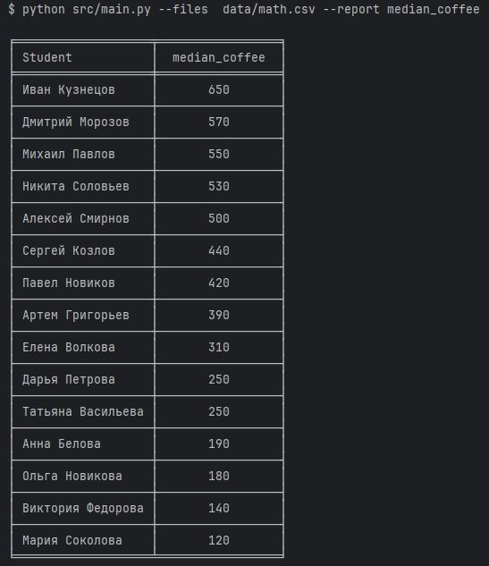
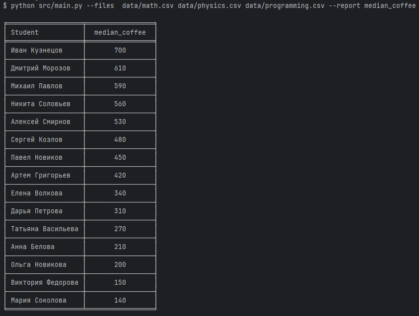

Запуск всех тестов сразу с покрытием - pytest tests/test.py -v --cov=src --cov-report=term
Запуск скрипта только для math.csv - python src/main.py --files  data/math.csv --report median_coffee
Запуск скрипта для всех csv исходников - python src/main.py --files  data/math.csv data/physics.csv data/programming.csv --report median_coffee